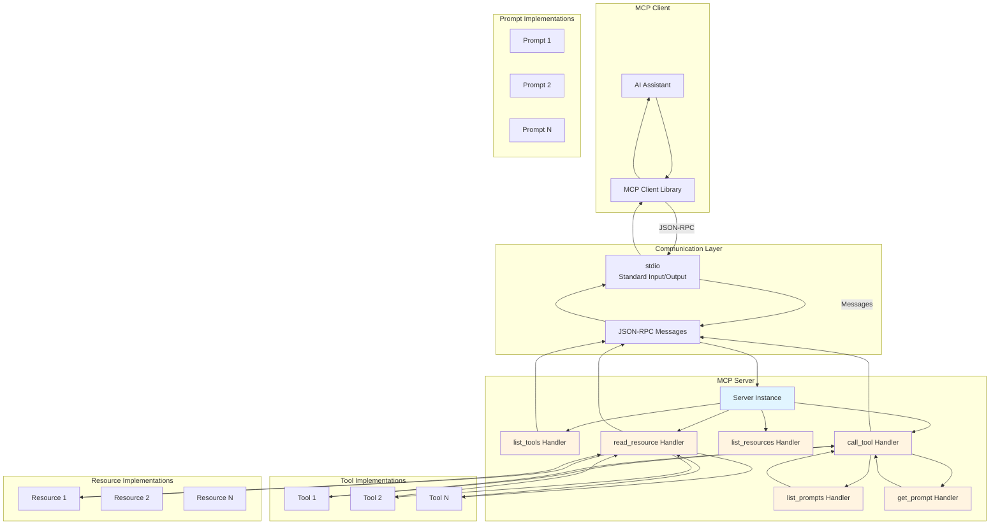
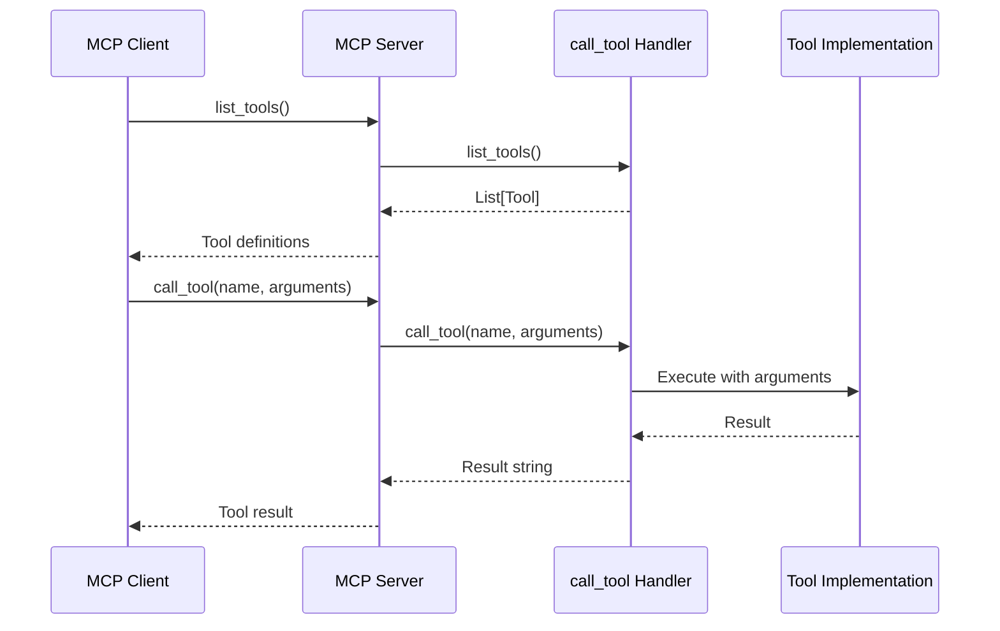
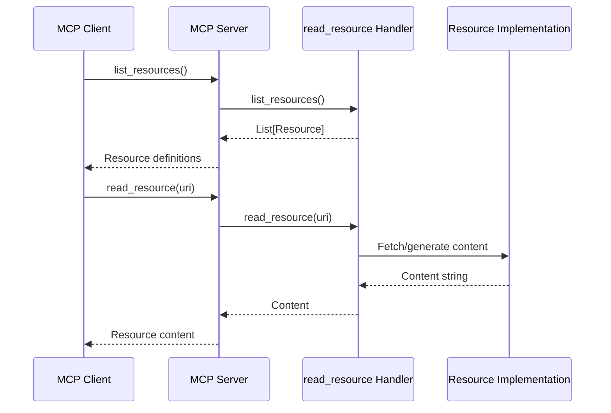
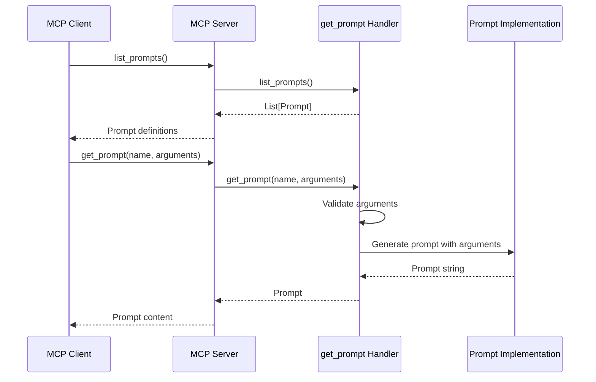

# MCP Server Architecture

This document describes the architecture of the MCP server boilerplate, including the Python modules used, their purposes, and how they work together.

## Overview

The Model Context Protocol (MCP) is a standardized protocol that enables AI assistants to interact with external servers. This boilerplate provides a minimal, well-documented implementation that can serve as a baseline for building custom MCP servers.

## Python Modules and Their Purposes

### Core MCP Modules

#### `mcp.server.Server`
- **Purpose**: Main server class that handles MCP protocol communication
- **Usage**: Create an instance with a unique server identifier
- **Key Methods**:
  - `@app.list_tools()`: Decorator to register tool listing handler
  - `@app.call_tool()`: Decorator to register tool invocation handler
  - `@app.list_resources()`: Decorator to register resource listing handler
  - `@app.read_resource()`: Decorator to register resource reading handler
  - `@app.list_prompts()`: Decorator to register prompt listing handler
  - `@app.get_prompt()`: Decorator to register prompt retrieval handler
  - `run()`: Start the server event loop with communication streams

#### `mcp.types.Tool`
- **Purpose**: Type definition for MCP tools
- **Fields**:
  - `name`: Unique identifier for the tool
  - `description`: Human-readable description
  - `inputSchema`: JSON Schema defining input parameters
- **Usage**: Define tools that AI clients can invoke

#### `mcp.types.Resource`
- **Purpose**: Type definition for MCP resources
- **Fields**:
  - `uri`: Unique identifier for the resource
  - `name`: Human-readable name
  - `description`: Description of resource content
  - `mimeType`: MIME type (e.g., "text/plain", "application/json")
- **Usage**: Define data sources that AI clients can read

#### `mcp.types.Prompt`
- **Purpose**: Type definition for MCP prompts
- **Fields**:
  - `name`: Unique identifier for the prompt
  - `description`: Human-readable description
  - `arguments`: List of `PromptArgument` objects defining template variables
- **Usage**: Define reusable prompt templates that AI clients can use

#### `mcp.types.PromptArgument`
- **Purpose**: Type definition for prompt template arguments
- **Fields**:
  - `name`: Name of the argument/variable in the template
  - `description`: Description of what the argument represents
  - `required`: Whether the argument is required (default: false)
- **Usage**: Define parameters that can be filled in prompt templates

#### `mcp.server.stdio.stdio_server`
- **Purpose**: Creates stdio (standard input/output) streams for communication
- **Usage**: Standard way MCP servers communicate with clients
- **Returns**: Tuple of (read_stream, write_stream) for JSON-RPC messages

### Standard Library Modules

#### `asyncio`
- **Purpose**: Provides asynchronous I/O support
- **Why Used**: MCP servers use async/await pattern for concurrent operations
- **Key Functions**:
  - `asyncio.run()`: Run async functions from synchronous code
  - `async/await`: Define coroutines for non-blocking operations
- **Benefits**: Allows server to handle multiple requests concurrently

#### `typing`
- **Purpose**: Provides type hints for better code clarity and IDE support
- **Why Used**: Improves code documentation and catches type errors early
- **Common Types**:
  - `Any`: Represents any type
  - `list[Tool]`: List of Tool objects
  - `list[Resource]`: List of Resource objects
  - `list[Prompt]`: List of Prompt objects
  - `dict[str, Any]`: Dictionary with string keys and any values
  - `dict[str, str] | None`: Optional dictionary of string keys and values

## Architecture Diagram

## Request Flow Diagrams

### Tool Invocation Flow

### Resource Reading Flow

### Prompt Retrieval Flow

## Component Interactions

### Server Initialization
1. Create `Server` instance with unique identifier
2. Register handlers using decorators (`@app.list_tools`, etc.)
3. Create stdio streams for communication
4. Start server event loop with `app.run()`

### Tool Discovery
1. Client calls `list_tools()`
2. Server invokes decorated `list_tools()` handler
3. Handler returns list of `Tool` objects with metadata
4. Server sends tool definitions to client

### Tool Execution
1. Client calls `call_tool(name, arguments)`
2. Server invokes decorated `call_tool()` handler
3. Handler validates arguments and executes tool logic
4. Handler returns result as string
5. Server sends result to client

### Resource Discovery
1. Client calls `list_resources()`
2. Server invokes decorated `list_resources()` handler
3. Handler returns list of `Resource` objects with metadata
4. Server sends resource definitions to client

### Resource Reading
1. Client calls `read_resource(uri)`
2. Server invokes decorated `read_resource()` handler
3. Handler fetches or generates resource content
4. Handler returns content as string
5. Server sends content to client

### Prompt Discovery
1. Client calls `list_prompts()`
2. Server invokes decorated `list_prompts()` handler
3. Handler returns list of `Prompt` objects with metadata
4. Server sends prompt definitions to client

### Prompt Retrieval
1. Client calls `get_prompt(name, arguments)`
2. Server invokes decorated `get_prompt()` handler
3. Handler validates arguments against prompt schema
4. Handler generates prompt content by substituting arguments
5. Handler returns prompt as string
6. Server sends prompt to client

## Design Patterns

### Decorator Pattern
The MCP server uses decorators to register handlers:
- Clean separation of registration and implementation
- Declarative style for handler registration
- Easy to add new handlers without modifying core logic

### Async/Await Pattern
All handlers are async functions:
- Non-blocking I/O operations
- Concurrent request handling
- Better performance for I/O-bound operations

### Type Hints
All functions include type hints:
- Better IDE support and autocomplete
- Documentation of expected types
- Early error detection with type checkers

## Extension Points

The boilerplate provides clear extension points:

1. **Add Tools**: Implement new functions and register with `@app.call_tool()`
2. **Add Resources**: Implement new functions and register with `@app.read_resource()`
3. **Add Prompts**: Implement new functions and register with `@app.get_prompt()`
4. **Custom Logic**: Replace placeholder implementations with actual business logic
5. **Error Handling**: Add custom exceptions and error recovery logic
6. **State Management**: Add session state or persistent storage as needed
